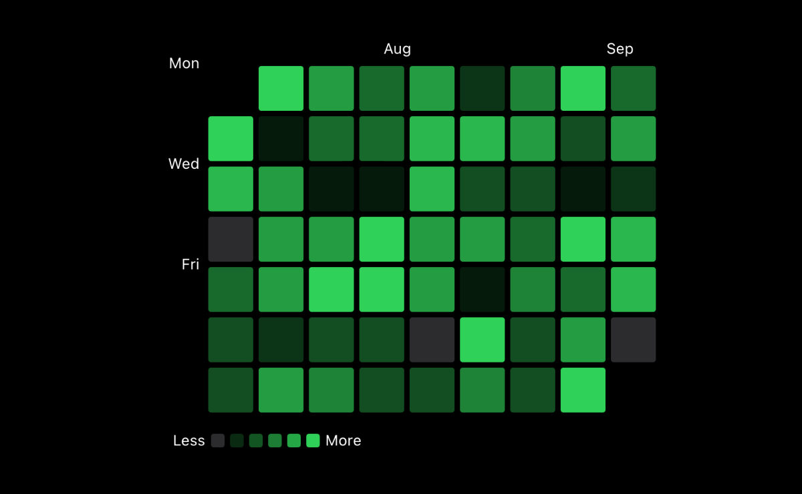

# Github Contribution Graph Example

An example project for [Github contribution graph with Swift Charts](https://www.artemnovichkov.com/blog/github-contribution-graph-swift-charts) article.

  

## Author

Artem Novichkov, https://www.artemnovichkov.com/about

## License

The project is available under the MIT license. See the [LICENSE](./LICENSE) file for more info.
